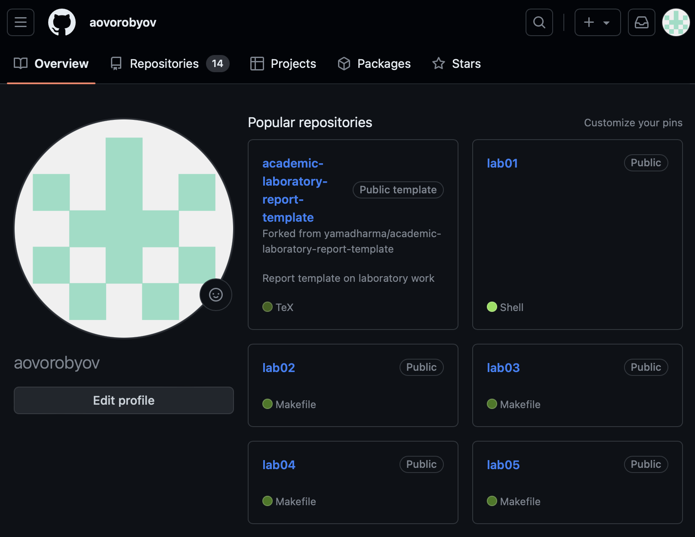
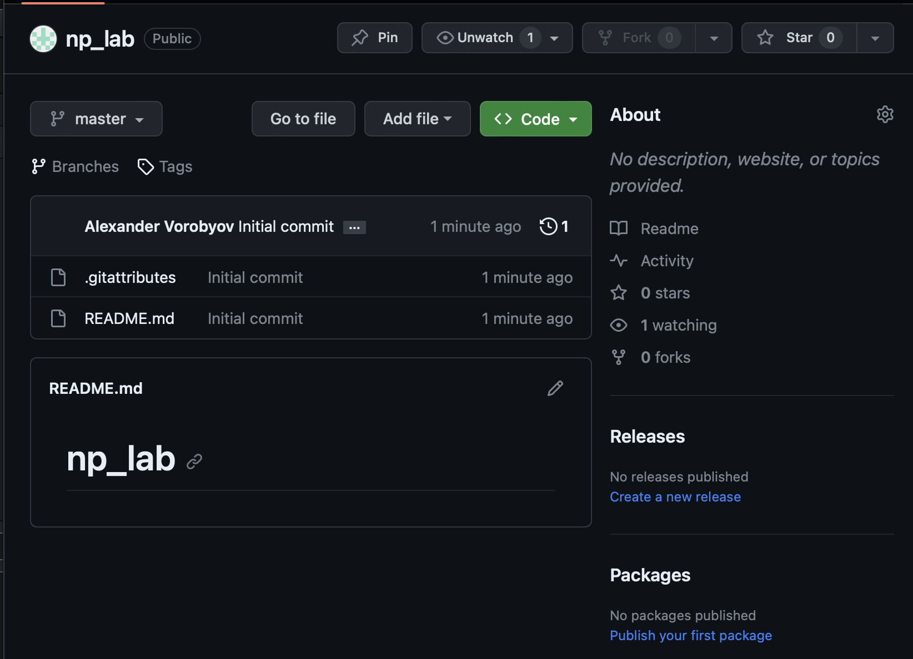

---
## Front matter
lang: ru-RU
title: Отчет по лабораторной работе №1.
subtitle: Управление версиями

author: |
	Alexander O. Vorobyov\inst{1}
	
institute: |
	\inst{1}RUDN University, Moscow, Russian Federation
	
date: 21 September, 2023

## Formatting
toc: false
slide_level: 2
theme: metropolis
header-includes: 
 - \metroset{progressbar=frametitle,sectionpage=progressbar,numbering=fraction}
 - '\makeatletter'
 - '\beamer@ignorenonframefalse'
 - '\makeatother'
aspectratio: 43
section-titles: true
---

# Прагматика выполнения

## Прагматика выполнения

Лабораторная работа выполняется для получения знаний о способе заведения аккаунта в системе управления версиями Git и создания репозитория. 

# Цель работы

## Цель работы

Целью данной работы является приобретение практических навыков создания аккаунта, получение необхожимых ключей и создание репозитория для публикации заданий по предмету.

# Задачи выполнения 

## Задачи выполнения  

1. ккаунт на GitHub уже был создан.  
{ #fig:001 width=70% } 
	
## Задачи выполнения  

2. Создал репозиторий для публикации заданий по предмету. 

{ #fig:002 width=70% }   

# Результаты выполнения 

## Результаты выполнения 

В результате проделанной работы я приобрел практические навыки создания репозиториев в системе управления версиями.

