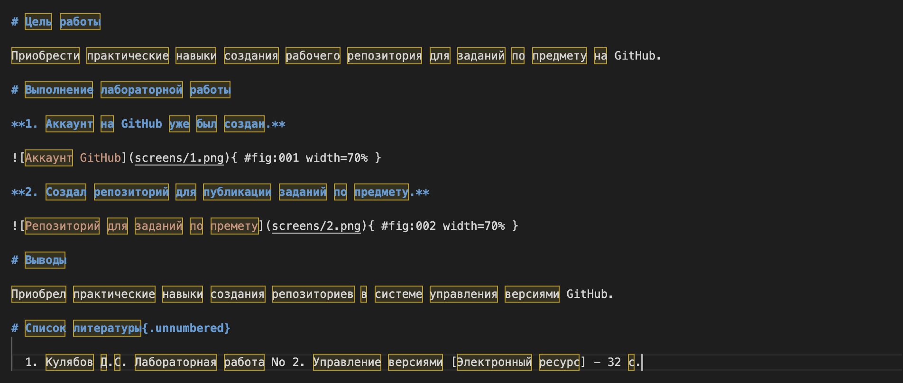

---
## Front matter
lang: ru-RU
title: Отчет по лабораторной работе №2.
subtitle: Markdown

author: |
	Alexander O. Vorobyov\inst{1}
	
institute: |
	\inst{1}RUDN University, Moscow, Russian Federation
	
date: 28 September, 2023

## Formatting
toc: false
slide_level: 2
theme: metropolis
header-includes: 
 - \metroset{progressbar=frametitle,sectionpage=progressbar,numbering=fraction}
 - '\makeatletter'
 - '\beamer@ignorenonframefalse'
 - '\makeatother'
aspectratio: 43
section-titles: true
---

# Прагматика выполнения

## Прагматика выполнения

Лабораторная работа выполняется для получения знаний о создании разметки в тексте на языке Markdown. 

# Цель работы

## Цель работы

Целью данной работы является приобретение практических навыков работы с языком разметки Markdown

# Задачи выполнения 

## Задачи выполнения  

1. Запись отчета по 1 лабораторной работе на языке Markdown.  
{ #fig:001 width=70% }  

# Результаты выполнения 

## Результаты выполнения 

В результате проделанной работы я приобрел практические навыки написания текста с разметкой на языке Markdown.

