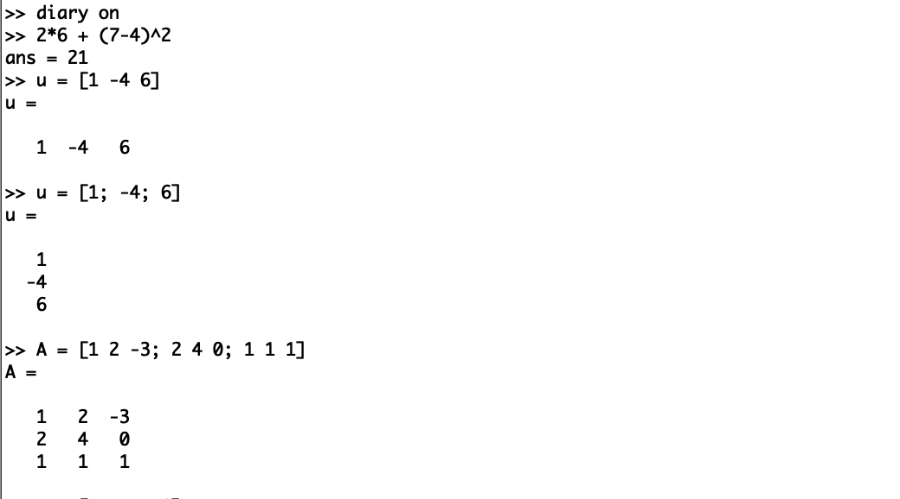
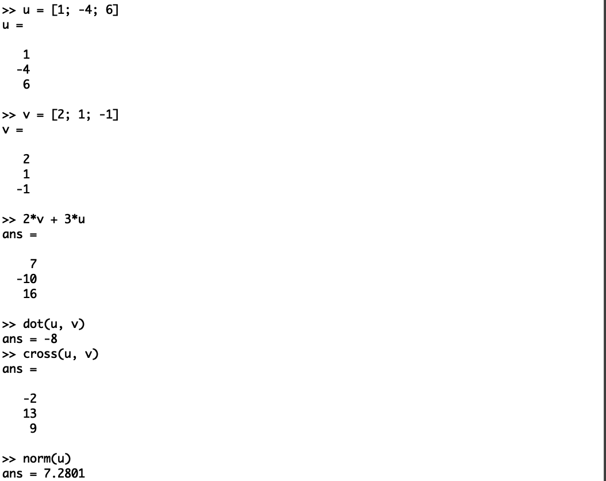
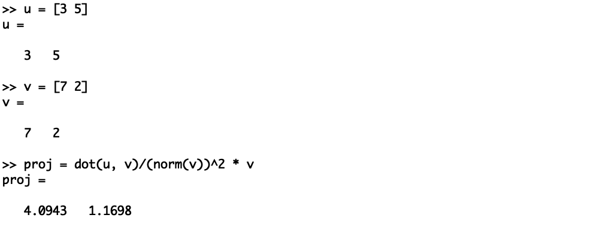
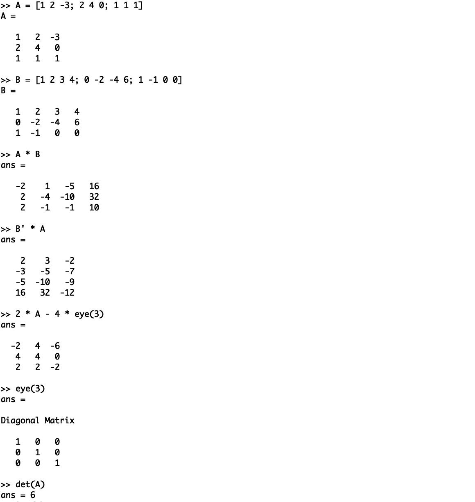
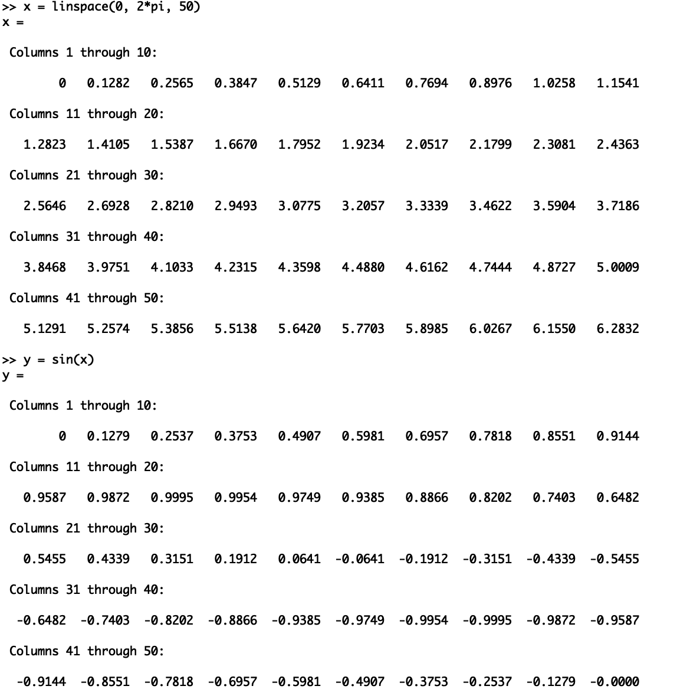
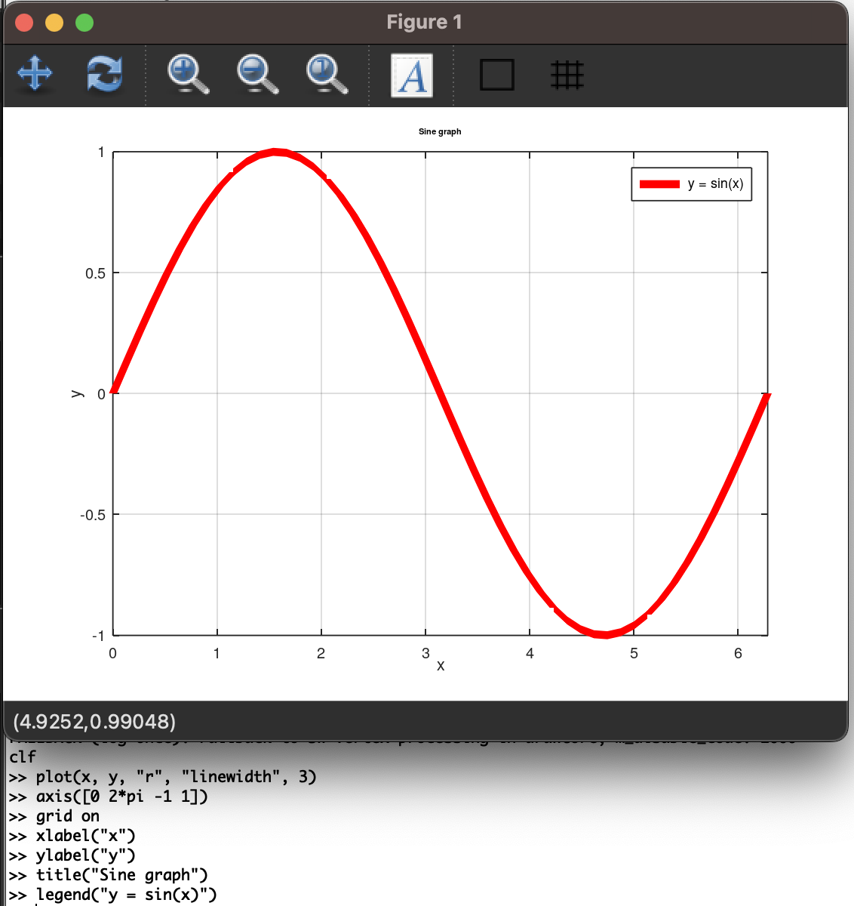
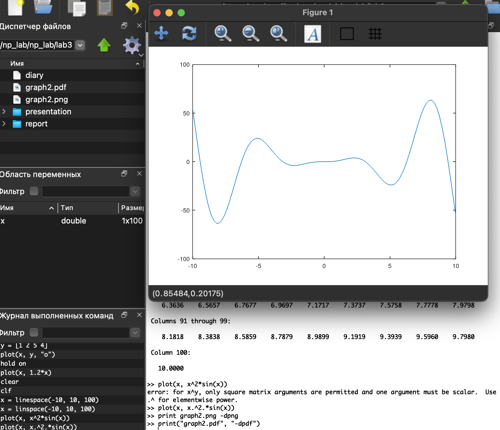
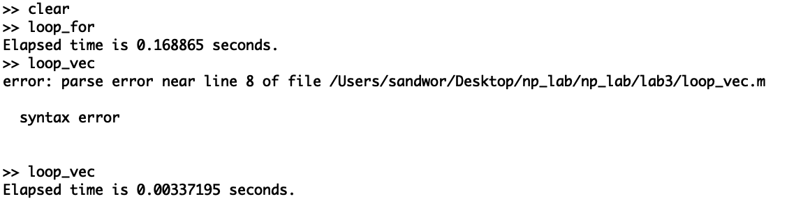

---
## Front matter
lang: ru-RU
title: Отчет по лабораторной работе №3.
subtitle: Введение в работу с Octave

author: |
	Alexander O. Vorobyov\inst{1}
	
institute: |
	\inst{1}RUDN University, Moscow, Russian Federation
	
date: 11 October, 2023

## Formatting
toc: false
slide_level: 2
theme: metropolis
header-includes: 
 - \metroset{progressbar=frametitle,sectionpage=progressbar,numbering=fraction}
 - '\makeatletter'
 - '\beamer@ignorenonframefalse'
 - '\makeatother'
aspectratio: 43
section-titles: true
---

# Прагматика выполнения

## Прагматика выполнения

Лабораторная работа выполняется для получения знаний о работе в Octave. 

# Цель работы

## Цель работы

Целью данной работы является приобретение практических навыков работы в Octave

# Задачи выполнения  

## Задачи выполнения  

1. Простейшие операции.    
{ #fig:001 width=70% }  

## Задачи выполнения  

2. Операции с векторами  
{ #fig:002 width=70% }  

## Задачи выполнения  

3. Вычисление проектора    
{ #fig:003 width=70% }  

## Задачи выполнения  

4. Матричные операции  
{ #fig:004 width=70% }  

## Задачи выполнения  

5. Построение простейших графиков  
{ #fig:005 width=70% }  

{ #fig:006 width=70% } 

## Задачи выполнения  

6. Два графика на одном чертеже  
{ #fig:008 width=70% }  

## Задачи выполнения  

8. Сравнение циклов и операций с векторами  
{ #fig:009 width=70% }  

# Результаты выполнения 

## Результаты выполнения 

В результате проделанной работы я приобрел практические навыки работы в Octave.

