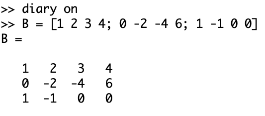
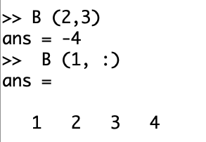
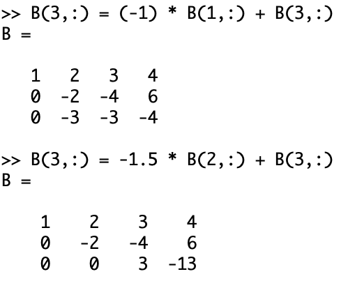
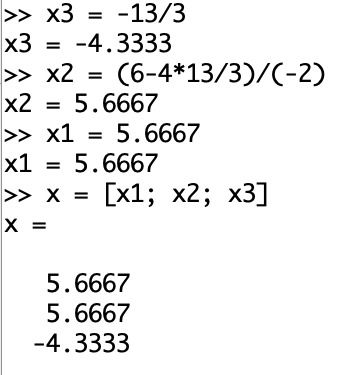
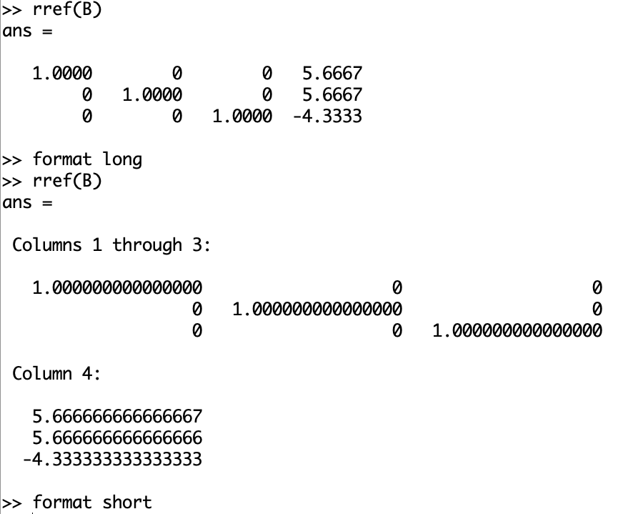
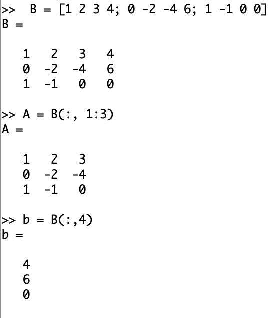
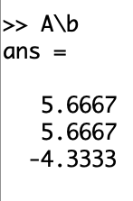
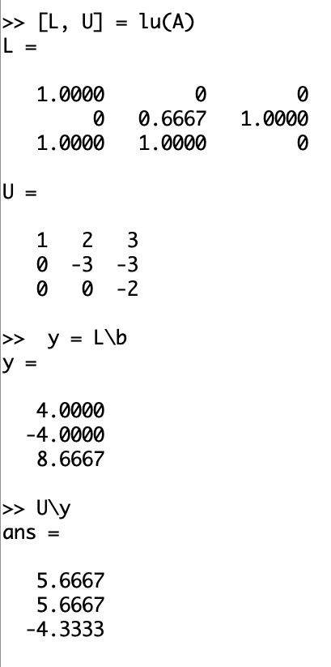
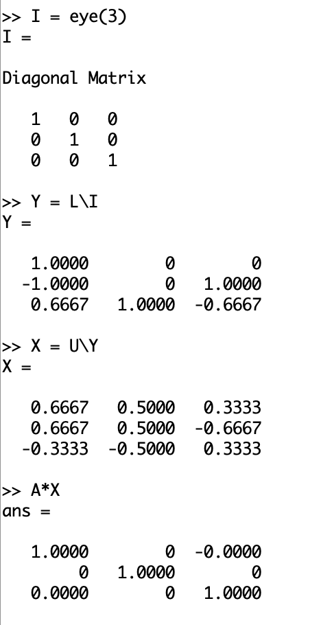
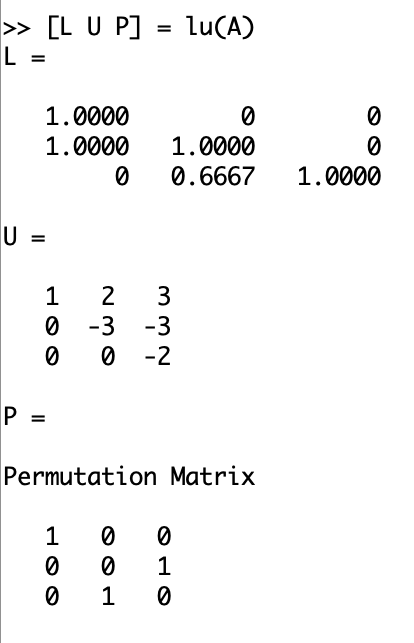

---
# Front matter
lang: ru-RU
title: "Лабораторная работа №4"
subtitle: "Системы линейных уравнений"
author: "Воробьев А.О."

# Formatting
toc-title: "Содержание"
toc: true # Table of contents
toc_depth: 2
lof: true # List of figures
# lot: true # List of tables
fontsize: 12pt
linestretch: 1.5
papersize: a4paper
documentclass: scrreprt
polyglossia-lang: russian
polyglossia-otherlangs: english
mainfont: PT Serif
romanfont: PT Serif
sansfont: PT Sans
monofont: PT Mono
mainfontoptions: Ligatures=TeX
romanfontoptions: Ligatures=TeX
sansfontoptions: Ligatures=TeX,Scale=MatchLowercase
monofontoptions: Scale=MatchLowercase
indent: true
pdf-engine: lualatex
header-includes:
  - \linepenalty=10 # the penalty added to the badness of each line within a paragraph (no associated penalty node) Increasing the value makes tex try to have fewer lines in the paragraph.
  - \interlinepenalty=0 # value of the penalty (node) added after each line of a paragraph.
  - \hyphenpenalty=50 # the penalty for line breaking at an automatically inserted hyphen
  - \exhyphenpenalty=50 # the penalty for line breaking at an explicit hyphen
  - \binoppenalty=700 # the penalty for breaking a line at a binary operator
  - \relpenalty=500 # the penalty for breaking a line at a relation
  - \clubpenalty=150 # extra penalty for breaking after first line of a paragraph
  - \widowpenalty=150 # extra penalty for breaking before last line of a paragraph
  - \displaywidowpenalty=50 # extra penalty for breaking before last line before a display math
  - \brokenpenalty=100 # extra penalty for page breaking after a hyphenated line
  - \predisplaypenalty=10000 # penalty for breaking before a display
  - \postdisplaypenalty=0 # penalty for breaking after a display
  - \floatingpenalty = 20000 # penalty for splitting an insertion (can only be split footnote in standard LaTeX)
  - \raggedbottom # or \flushbottom
  - \usepackage{float} # keep figures where there are in the text
  - \floatplacement{figure}{H} # keep figures where there are in the text
---

# Цель работы

Научиться решать системы линейных уравнений в Octave.

# Задание работы

Решить данную систему методом Гаусса, встроенной командой (левым делением), с помощью разложений LU и LUP.

# Выполнение лабораторной работы

## Метод Гаусса

1. Начал журналирование и задал расширенную матрицу B. (@fig:002)

{ #fig:002 width=70%}

2. Попробовал поэлементный и построчный просмотры матрицы. (@fig:003)

{ #fig:003 width=70%}

3. Привел матрицу к ступенчатому/треугольному виду с помощью операций над строками. (@fig:004)

{ #fig:004 width=50%}

4. Нашел решение системы. (@fig:005)

{ #fig:005 width=50%}

5. Нашел решение системы с помощью команды rref() с разными точностями. (@fig:006)

{ #fig:006 width=70%}

## Левое деление

1. Выделил из расширенной матрицы матрицу А и столбец b. (@fig:007)

{ #fig:007 width=50%}

2. Нашел решение системы левым делением. (@fig:008)

{ #fig:008 width=30%}

## LU-разложение

1. С помощью команды lu() разложил матрицу А и нашел решение системы левым делением. (@fig:009)

{ #fig:009 width=50%}

2. (*) С помощью LU-разложения нашел обратную матрицу А ($A^{-1}$). (@fig:010)

{ #fig:010 width=50%}

## LUP-разложение

1. С помощью команды lu() разложил матрицу А. (@fig:011)

{ #fig:011 width=50%}

# Вывод

В ходе выполнения работы мы научились решать линейные системы в Octave разными способами, а именно: методом Гаусса, встроенными командами и с помощиью LU- и LUP-разложений.
