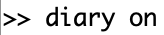
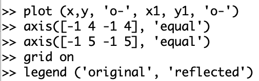

---
# Front matter
lang: ru-RU
title: "Лабораторная работа №5"
#subtitle: ""
author: "Воробьев А.О. НПМмд-02-23"

# Formatting
toc-title: "Содержание"
toc: true # Table of contents
toc_depth: 2
lof: true # List of figures
# lot: true # List of tables
fontsize: 12pt
linestretch: 1.5
papersize: a4paper
documentclass: scrreprt
polyglossia-lang: russian
polyglossia-otherlangs: english
mainfont: PT Serif
romanfont: PT Serif
sansfont: PT Sans
monofont: PT Mono
mainfontoptions: Ligatures=TeX
romanfontoptions: Ligatures=TeX
sansfontoptions: Ligatures=TeX,Scale=MatchLowercase
monofontoptions: Scale=MatchLowercase
indent: true
pdf-engine: lualatex
header-includes:
  - \linepenalty=10 # the penalty added to the badness of each line within a paragraph (no associated penalty node) Increasing the value makes tex try to have fewer lines in the paragraph.
  - \interlinepenalty=0 # value of the penalty (node) added after each line of a paragraph.
  - \hyphenpenalty=50 # the penalty for line breaking at an automatically inserted hyphen
  - \exhyphenpenalty=50 # the penalty for line breaking at an explicit hyphen
  - \binoppenalty=700 # the penalty for breaking a line at a binary operator
  - \relpenalty=500 # the penalty for breaking a line at a relation
  - \clubpenalty=150 # extra penalty for breaking after first line of a paragraph
  - \widowpenalty=150 # extra penalty for breaking before last line of a paragraph
  - \displaywidowpenalty=50 # extra penalty for breaking before last line before a display math
  - \brokenpenalty=100 # extra penalty for page breaking after a hyphenated line
  - \predisplaypenalty=10000 # penalty for breaking before a display
  - \postdisplaypenalty=0 # penalty for breaking after a display
  - \floatingpenalty = 20000 # penalty for splitting an insertion (can only be split footnote in standard LaTeX)
  - \raggedbottom # or \flushbottom
  - \usepackage{float} # keep figures where there are in the text
  - \floatplacement{figure}{H} # keep figures where there are in the text
---

# Цель работы

Научиться решать проблему подгонки полиномиальной кривой и научиться реализовывать некоторые матричные преобразования.

# Задание работы

Выполнить лабораторную работу и сделать отчет по лабораторной работе в форматах md, docx и pdf.

# Выполнение лабораторной работы

1. Создаем каталог для работы в папке laboratory. (mkdir) (@fig:001)

{ #fig:001 width=80% }

2. Начинаем сессию журналирования. (@fig:002)

{ #fig:002 width=40% }

## Подгонка полиномиальной кривой

1. Задаем набор точек через матрицу D. (@fig:003)

{ #fig:003 width=80% }

2. Извлекаем вектора x и y. (@fig:004)

{ #fig:004 width=60% }

3. Рисуем точки на графике. (plot) (@fig:005 и @fig:006)

{ #fig:005 width=50% }

{ #fig:006 width=80% }

4. Задаем матрицу коэффициентов А: сначала делаем ее единичной матрицей, потом меняем первый столбец на квадрат координат точек по х, а второй — просто на координаты. (@fig:007, @fig:008 и @fig:009)

{ #fig:007 width=60% }

{ #fig:008 width=60% }

{ #fig:009 width=60% }

5. Находим матрицы $A^TA$ и $A^Ty$, необходимые нам для решения. (@fig:010)

{ #fig:010 width=60% }

6. Из них задаем расширенную матрицу B, для решения методом Гаусса. (@fig:011)

{ #fig:011 width=80% }

7. Решаем методом Гаусса (rref) и записывем ответ в отдельные переменные. (@fig:012)

{ #fig:012 width=80% }

8. Задаем значения по x для графика и функцию y как квадратное уравнение с полученными коэффициентами. Строим график исходных данных и нашей подогранной параболы. (@fig:013 и @fig:014)

{ #fig:013 width=80% }

{ #fig:014 width=80% }

9. Получим коэффициенты с помощью встроенной программы polyfit. (@fig:015)

{ #fig:015 width=80% }

10. Найдем значения полинома в точках. (polyval) (@fig:016)

{ #fig:016 width=80% }

1.  Построим график по полученным точкам. (@fig:017 и @fig:018)

{ #fig:017 width=80% }

{ #fig:018 width=80% }

## Матричные преобразования

1. Строим изображение по циклу Эйлера: задаем матрицу точек, выделяем координаты по x и y, строим график. (@fig:019 и @fig:020)

{ #fig:019 width=80% }

{ #fig:020 width=80% }

### Вращение

1. Задаем угол поворота $\theta_1$ и соответсующую ему матрицу поворота  $R_1$. (@fig:021)

{ #fig:021 width=80% }

1. Для того чтобы воспроизвести поворот матрицы умножаем $R_1$ на $D$. (@fig:022)

{ #fig:022 width=80% }

3. Выделяем координаты точек. (@fig:023)

{ #fig:023 width=80% }

4. Задаем угол поворота $\theta_2$ и проделываем то же самое для него. (@fig:024, @fig:025 и @fig:026)

{ #fig:024 width=80% }

{ #fig:025 width=80% }

{ #fig:026 width=80% }

5. Строим график с исходным изображением и двумя перевернутыми. (@fig:027 и @fig:028)

{ #fig:027 width=80% }

{ #fig:028 width=80% }

### Отражение

1. Задаем матрицу отражения относительно прямой $l$ ($y=x$). (@fig:029)

{ #fig:029 width=50% }

2. Отражаем, перемножая матрицу $R$ на $D$. (@fig:030)

{ #fig:030 width=80% }

3. Выделяем координаты по x и по y. (@fig:031)

{ #fig:031 width=80% }

4. Строим изображения. (@fig:032 и @fig:033)

{ #fig:032 width=70% }

{ #fig:033 width=80% }

### Дилатация

1. Задаем матрицу дилатации $T$. (@fig:034)

{ #fig:034 width=80% }

2. Выполняем матричное преобразование. (@fig:035)

{ #fig:035 width=50% }

3. Выделяем координаты точек. (@fig:036)

{ #fig:036 width=80% }

4. Строим изображения. (@fig:037 и @fig:038)

{ #fig:037 width=80% }

{ #fig:038 width=80% }

5. Завершаем сессию журналирования. (@fig:039)

{ #fig:039 width=40% }

# Вывод

В ходе выполнения работы мы научились подгонке данных к общим уравнениям (в ручную и через встроенную команду polyfit), а так же матричным преобразованиям, таким как вращение, отражение и дилатация.