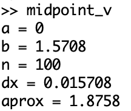

---
# Front matter
lang: ru-RU
title: "Лабораторная работа №6"
#subtitle: ""
author: "Воробьев А.О. НПМмд-02-23"

# Formatting
toc-title: "Содержание"
toc: true # Table of contents
toc_depth: 2
lof: true # List of figures
# lot: true # List of tables
fontsize: 12pt
linestretch: 1.5
papersize: a4paper
documentclass: scrreprt
polyglossia-lang: russian
polyglossia-otherlangs: english
mainfont: PT Serif
romanfont: PT Serif
sansfont: PT Sans
monofont: PT Mono
mainfontoptions: Ligatures=TeX
romanfontoptions: Ligatures=TeX
sansfontoptions: Ligatures=TeX,Scale=MatchLowercase
monofontoptions: Scale=MatchLowercase
indent: true
pdf-engine: lualatex
header-includes:
  - \linepenalty=10 # the penalty added to the badness of each line within a paragraph (no associated penalty node) Increasing the value makes tex try to have fewer lines in the paragraph.
  - \interlinepenalty=0 # value of the penalty (node) added after each line of a paragraph.
  - \hyphenpenalty=50 # the penalty for line breaking at an automatically inserted hyphen
  - \exhyphenpenalty=50 # the penalty for line breaking at an explicit hyphen
  - \binoppenalty=700 # the penalty for breaking a line at a binary operator
  - \relpenalty=500 # the penalty for breaking a line at a relation
  - \clubpenalty=150 # extra penalty for breaking after first line of a paragraph
  - \widowpenalty=150 # extra penalty for breaking before last line of a paragraph
  - \displaywidowpenalty=50 # extra penalty for breaking before last line before a display math
  - \brokenpenalty=100 # extra penalty for page breaking after a hyphenated line
  - \predisplaypenalty=10000 # penalty for breaking before a display
  - \postdisplaypenalty=0 # penalty for breaking after a display
  - \floatingpenalty = 20000 # penalty for splitting an insertion (can only be split footnote in standard LaTeX)
  - \raggedbottom # or \flushbottom
  - \usepackage{float} # keep figures where there are in the text
  - \floatplacement{figure}{H} # keep figures where there are in the text
---

# Цель работы

Научиться работать в Octave с пределами, последовательностями, рядами и численным интегрированием.

# Задание работы

Выполнить лабораторную работу и сделать отчет по лабораторной работе в форматах md, docx и pdf.

# Теоретичсекое введение

В octave можно реализовать пределы, последовательности и ряды, а так же считать определенный интеграл.

- Предел —  одно из основных понятий математического анализа, на него опираются такие фундаментальные разделы анализа, как непрерывность, производная, интеграл, бесконечные ряды и др. Различают предел последовательности и предел функции.

- Последовательность — это пронумерованный набор каких-либо объектов, среди которых допускаются повторения, причём порядок объектов имеет значение. Нумерация чаще всего происходит натуральными числами.

- Ряд, называемый также бесконечная сумма — одно из центральных понятий математического анализа. В простейшем случае ряд записывается как бесконечная сумма чисел:

  $\sum_{n=1}^{\infty}$$a_n$ (иногда нумерацию слагаемых начинают не с 1, а с 0)

- Определённый интеграл — одно из основных понятий математического анализа, один из видов интеграла. Определённый интеграл является числом, равным пределу сумм особого вида (интегральных сумм). Геометрически определённый интеграл выражает площадь «криволинейной трапеции», ограниченной графиком функции.

- Квадратура (лат. quadratura, придание квадратной формы) — математический термин, первоначально обозначавший нахождение площади какой-либо фигуры или поверхности. То есть, мы разбиваем/приближаем площадь под графиком к набору прямоугольников одинаковой ширины.

- правило средней точки:
  
  Аппроксимация f в середине интервалов дает f (a + Δx / 2) для первого интервала, для следующий f (a + 3Δx / 2), и так далее до f (b - Δx / 2). Суммирование площадей дает:
  $A_{mid} = Δx [f(a + \frac{Δx}{2} + f(a + \frac{3Δx}{2}) + ... + f(b - \frac{Δx}{2})]$

# Выполнение лабораторной работы

1. Создаем каталог для работы в папке laboratory. (mkdir) (@fig:001)

{ #fig:001 width=80% }

2. Начинаем сессию журналирования. (@fig:002)

{ #fig:002 width=40% }

## Пределы, последовательности и ряды

### Предел

1. Для расчета предела функции, нужно сначала определить функцию. (@fig:003)

{ #fig:003 width=80% }

2. Создаем индексную переменную. (@fig:004)

{ #fig:004 width=80% }

3. Берем степени 10, которые будут входными значениями. (@fig:005)

{ #fig:005 width=80% }

4. Оцениваем $f(n)$. (@fig:006)

{ #fig:006 width=80% }

### Частичные суммы

1. Задаем вектор входных значений/индексов. (@fig:007)

{ #fig:007 width=80% }

2. Высчитываем члены ряда. (@fig:008)

{ #fig:008 width=80% }

3. Пишем цикл для суммирования членов ряда, получаем суммы 2 член, 2-3 член, 3-4 член и тд. до 2-11 член. (@fig:009)

{ #fig:009 width=80% }

4. Строим график с полученными данными. (@fig:010 и @fig:011)

{ #fig:010 width=80% }

{ #fig:011 width=80% }

### Сумма ряда

1. Задаем вектор входных значений/индексов. (@fig:012)

{ #fig:012 width=80% }

2. Задаем гармонический ряд. Задаем вектор входных значений/индексов. (@fig:013)

{ #fig:013 width=80% }

3. Вычисляем сумму ряда. Задаем вектор входных значений/индексов. (@fig:014)

{ #fig:014 width=80% }

## Численное интегрирование

### Вычисление интегралов

1. Определяем функцию, чей интеграл мы будем считать, и считаем определенный интеграл командой quad. (@fig:015)

{ #fig:015 width=80% }

2. Рассчитаем определенный интеграл, используя анонимную функцию. (@fig:016)

{ #fig:016 width=80% }

### Аппроксимирование суммами

1. Создаем файл Octave. (@fig:017)

{ #fig:017 width=80% }

2. В нем записываем реализацию метода средней точки с помощью цикла. (@fig:018)

{ #fig:018 width=80% }

3. Запускаем файл. (@fig:019)

{ #fig:019 width=80% }

4. Создаем второй файл Octave. (@fig:020)

{ #fig:020 width=80% }

5. В нем записываем векторизованную реализацию метода средней точки. (@fig:021)

{ #fig:021 width=80% }

6. Запускаем файл. (@fig:022)

{ #fig:022 width=80% }

7. Для того, чтобы увидеть разницу между двумя этими подходами, засекаем время выполнения файлов. (@fig:023)

{ #fig:023 width=80% }

Видим, что векторизированный код работает на порядок быстрее.

# Вывод

В ходе выполнения работы мы научились считать пределы и частичные суммы рядов, считать определенный интеграл встроенной окмандой quad и методом средней точки, а так же увидели разницу в скорости работы трандиционного кода (с циклами) и векторизированного кода.

# Библиография

1. *Lachniet J.* Introduction to GNU Octave. 2nd ed. 2019. pp. 39-45
2. wikichi.ru:Cумма Римана (https://wikichi.ru/wiki/Riemann_sum)
3. Wikipedia: Предел (https://ru.wikipedia.org/wiki/%D0%9F%D1%80%D0%B5%D0%B4%D0%B5%D0%BB_(%D0%BC%D0%B0%D1%82%D0%B5%D0%BC%D0%B0%D1%82%D0%B8%D0%BA%D0%B0))  